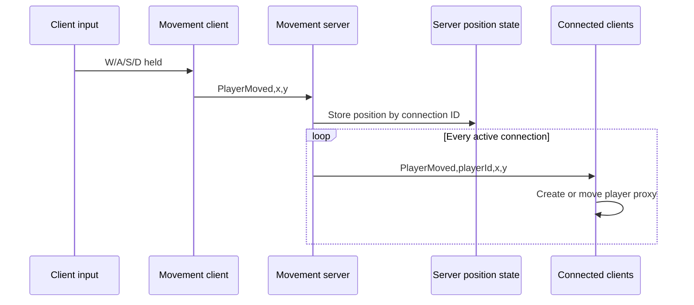

# Realtime Movement Client

Unity Transport client for a small realtime 2D movement prototype. It turns local keyboard input into position messages and renders the positions relayed by the server as player proxies.

**Paired repository:** [Realtime Movement Server](https://github.com/PapiChulllo/realtime-movement-server)

## Stack and configuration

- Unity `2022.3.5f1`
- Unity Transport `1.3.4`
- UDP port `9001`
- Current server IPv4 address: hardcoded `10.0.0.82`
- Scene: `Assets/Scenes/SampleScene.unity`

## How the pair works

1. `PlayerMovement` reads W, A, S, and D and immediately updates the local Player transform.
2. The client sends the resulting position as a `PlayerMoved` message.
3. The server derives the player ID from the connection, stores the client-reported position, and relays it to all active clients.
4. `GameLogic` creates a circle proxy when it first sees a player ID, then applies each received position.

## Transport pipelines

The client and server each create:

- **Reliable and in order:** `FragmentationPipelineStage` plus `ReliableSequencedPipelineStage`. `PlayerMovement` uses this pipeline for every current position message, and the server uses it for every position broadcast.
- **Fire and forget:** `FragmentationPipelineStage` without the reliable sequenced stage. The networking API supports selecting it, but no current gameplay call does so.

Messages are encoded with `.NET Encoding.Unicode` (UTF-16 little-endian), prefixed with their byte length as a transport `int`, and sent through the selected pipeline.

## Message protocol

| Direction | Message | Pipeline | Meaning |
| --- | --- | --- | --- |
| Client → server | `PlayerMoved,<x>,<y>` | Reliable sequenced | Reports the locally calculated position. |
| Server → clients | `PlayerMoved,<playerId>,<x>,<y>` | Reliable sequenced | Identifies a server connection and its latest reported position. |

The protocol is an unescaped comma-separated string with no schema version. Position formatting and `float.Parse` are culture-sensitive; a locale that formats decimals with commas can make the payload ambiguous.

## Connection lifecycle

- `NetworkClient.Start` creates the driver and both pipelines, registers a singleton-like static reference, and starts connecting to the configured IPv4 endpoint.
- Each frame completes the transport update and drains connect, data, and disconnect events.
- Connect and disconnect events are logged; the client does not retry after a failed or dropped connection.
- Server messages are passed to `NetworkClientProcessing`, parsed, and applied through `GameLogic`.
- On destruction, an active connection is disconnected and the driver is disposed.

## Run in the Unity Editor

1. Open the [server repository](https://github.com/PapiChulllo/realtime-movement-server) in Unity `2022.3.5f1`, open `Assets/Scenes/SampleScene.unity`, and enter Play mode first.
2. In this repository, open `Assets/Scripts/NetworkClient.cs`.
3. For localhost, change `const string IPAddress = "10.0.0.82";` to `127.0.0.1`. For LAN play, replace it with the server machine's IPv4 address. Do not change the `9001` port unless both projects are changed together.
4. Open this repository root as a separate Unity project with Unity `2022.3.5f1`.
5. Open `Assets/Scenes/SampleScene.unity` and enter Play mode only after the server is listening.
6. Focus the Game view and use W, A, S, and D.

The address is not exposed in the Inspector or a configuration file; `Assets/Scripts/NetworkClient.cs` is the exact place to change it. LAN hosts must also allow UDP `9001` through their firewall.

## Repository map

| Path | Responsibility |
| --- | --- |
| `Assets/Scripts/NetworkClient.cs` | Driver, endpoint, pipelines, event polling, message framing, sends, and teardown. |
| `Assets/Scripts/NetworkClientProcessing.cs` | Parses server messages and connects networking to client game logic. |
| `Assets/Scripts/PlayerMovement.cs` | Reads keyboard input, moves the local object, and reports positions. |
| `Assets/Scripts/GameLogic.cs` | Procedurally creates circle sprite textures at runtime and updates player proxies by ID. |
| `Assets/Scenes/SampleScene.unity` | Editor scene containing Client, Player, and camera objects. |
| `Packages/manifest.json` | Pins Unity Transport and other Unity package dependencies. |
| `ProjectSettings/` | Unity `2022.3.5f1` project configuration. |

## Authored responsibilities

This client side demonstrates direct Unity Transport connection management, custom message framing, selectable transport pipelines, responsive keyboard movement, separation between transport parsing and presentation, and dynamic per-player proxy creation. The paired server owns connection IDs, shared position state, late-join snapshots, and broadcasting.

## Limitations

- Movement is client-authoritative: the local transform moves before server processing, and the server accepts reported coordinates without speed, bounds, timestamp, or rate validation.
- There is no authentication, authorization, TLS/encryption, matchmaking, discovery, reconnect, interpolation, prediction, reconciliation, or persistence.
- The string/Unicode protocol is allocation-heavy, delimiter-sensitive, unversioned, and culture-sensitive for floats.
- Proxies are created on updates but never removed on disconnect. The server also retains stale position state after disconnect.
- The current destination `10.0.0.82` is environment-specific and requires a source edit for localhost or another LAN.
- There are no automated tests. Unity compilation, Play mode, and standalone builds have not been verified in this documentation pass because Unity was unavailable.

## Related project

See the [Realtime Movement Server](https://github.com/PapiChulllo/realtime-movement-server) for connection assignment, state relay, and broadcasting.
